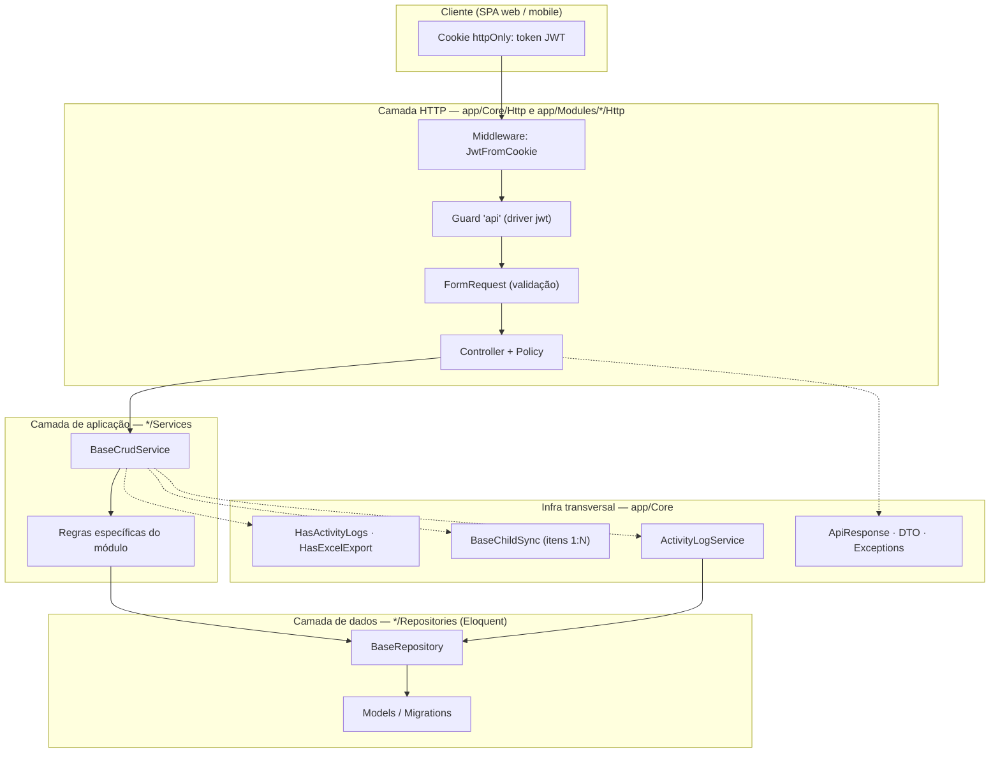

# Especificação Técnica — Simplify ERP API

> Como o sistema está estruturado e como as partes trabalham juntas. A visão de produto está em [`prd.md`](prd.md); comandos e configuração de ambiente, em [`../README.md`](../README.md). Regras de negócio e contrato funcional ficam no `prd.md` — aqui só aparecem quando são relevantes para a implementação.

---

## 1. Visão da arquitetura

Aplicação monolítica Laravel 13 organizada em três níveis de abstração, do mais genérico ao mais específico:



**O ponto central da arquitetura:** existe uma camada interna própria, `App\Core`, que funciona como um framework de aplicação. Ela define o formato de resposta, o ciclo de vida do CRUD, a validação de listagem, a auditoria, a exportação e o padrão de itens aninhados. Nenhum módulo de negócio escreve essas regras do zero; todos os estendem.

| Camada | Local | Responsabilidade |
|---|---|---|
| Núcleo | `app/Core` | Contratos e abstrações compartilhadas por todos os módulos |
| Módulos | `app/Modules/*` | Regras de negócio específicas de um domínio |
| Plataforma | `app/Policies`, `app/Providers` | Autorização e composição da aplicação |
| Gerador | `app/Console/Commands`, `app/Console/Stubs` | Produz módulos e o código de infraestrutura que eles exigem |

---

## 2. Camada Core

`app/Core` é dividido por preocupação técnica, não por domínio.

| Diretório | Conteúdo |
|---|---|
| `DTO/` | Objetos de transferência: `ServiceResult`, `ApiResponseDTO`, `AttributesDTO`, um DTO por entidade e a família `Paginator*`. |
| `Enums/` | `ActivityActionEnum`, `RequestQueryOperatorsEnum`, `SqlQueryOperatorsEnum`, `SqlOrderDirectionEnum`, `UserAgentEnum`. Todos `string`-backed, com `label()` em português. |
| `Exceptions/` | Exceções HTTP do projeto: `AccessDeniedHttpException`, `AuthenticationException`, `InvalidCredentialsException`, `NotFoundHttpException`, `BusinessRuleException`, `ValidationException`. |
| `Exports/` | `BaseExport` (estilo do cabeçalho e contrato `FromQuery`). |
| `Helpers/` | `ListHelpers` (remoção de nulos), `ModelHelpers` (filtros, ordenação, introspecção de schema), `PaginatorHelpers`, `StringHelpers`, `EnumHelpers`. |
| `Http/Controllers/` | `Controller` (base com o envelope e as annotations `@OA\OpenApi` da API) e os controllers das entidades de núcleo. |
| `Http/Requests/Core/` | `ListRequest`, `LookupRequest`, `ExportRequest` — o contrato de query compartilhado. |
| `Http/Resources/` | Resources e Collections de núcleo, incluindo os lookups. |
| `Models/` | `BaseModel` (rótulo de atividade e alias de morph) e a entidade `ActivityLog`. |
| `OA/Schemas/` | Schemas OpenAPI reutilizáveis: `Filters`, `FieldFilter`, `FilterValue`. |
| `Repositories/` | `BaseRepositoryInterface`, `BaseRepository` e os repositories de núcleo. |
| `Services/` | `BaseCrudService`, `ActivityLogService`, `SwaggerGeneratorFactory` e `Children/` (`ChildRelation`, `BaseChildSync`, `ChildSyncResult`). |
| `Traits/` | `ApiResponse`, `HasActivityLogs`, `HasExcelExport`. |

### 2.1 Ciclo de vida do CRUD

`BaseCrudService` (`app/Core/Services/BaseCrudService.php`) é a abstração central. Métodos públicos:

```php
store(mixed $data): ServiceResult           // cria cabeçalho + filhos + auditoria, em transação
update(Model $entity, mixed $data): ServiceResult
delete(Model $entity): ServiceResult
edit(Model $entity): ServiceResult          // sem escrita; devolve warnings e meta
list(array $filters = []): ServiceResult
show(Model $entity): ServiceResult
find(mixed $id): ServiceResult
lookup(array $params): ServiceResult
exportQuery(array $params = []): Builder
```

Pontos de gancho sobrescritíveis por módulo (métodos `protected` no-op no core; o módulo só sobrescreve o que precisar):

| Gancho | Finalidade | Quem usa |
|---|---|---|
| `prepareData(mixed $data): mixed` | Normalizar ou forçar valores antes da gravação. | `PartnerService`, `PermissionService` |
| `childRelations(): array` | Declarar relações 1:N sincronizadas junto do cabeçalho. | `PartnerService` |
| `beforeStore(mixed $data): void` | Regras de negócio que bloqueiam a inclusão (lançar `BusinessRuleException`). | `ProductCategoryService` (exemplo) |
| `beforeUpdate(Model $entity, mixed $data): void` | Regras de negócio que bloqueiam a alteração. | `ProductCategoryService` |
| `beforeDelete(Model $entity): void` | Regras de negócio que bloqueiam a exclusão. | `ProductCategoryService` |
| `afterStore(Model $entity, mixed $data): Model` | Pós-processamento da inclusão, dentro da transação; pode devolver a instância atualizada. | `UserService` (roles) |
| `afterUpdate(Model $entity, mixed $data): Model` | Pós-processamento da alteração, dentro da transação. | `UserService` (roles) |
| `afterDelete(Model $entity): void` | Pós-processamento da exclusão, dentro da transação. | — |
| `canEdit(Model $entity): bool` | Liga/desliga `meta.editable` no `edit()`, sem bloquear a leitura. | `ModuleService` (inativo) |
| `editWarnings(Model $entity): array` | Avisos ao cliente no `edit()`. | `ModuleService` (inativo) |
| `dataValue(mixed $data, string $key, mixed $default = null): mixed` | Lê um campo de payload heterogêneo (array, DTO, `Arrayable`, objeto) para uso nos hooks. | Core |
| `ActivityLogService` injetado | Registrar auditoria. | Todos |

Ordem de execução: os ganchos `before*` rodam **antes** da transação; `after*` rodam **dentro** da transação, imediatamente antes do log de auditoria.

`store` e `update` executam, dentro de uma única `DB::transaction`: hook `before*` fora da transação; depois gravação do cabeçalho, sincronização dos filhos, hook `after*` e registro da auditoria. `delete` também é transacional desde que passou a executar `beforeDelete`, exclusão, `afterDelete` e auditoria no mesmo bloco. `edit` devolve `meta.editable` (`canEdit()`), `warnings` (`editWarnings()`) e `meta.warnings`; `list`, `lookup`, `show` e `find` não abrem transação.

Regras de negócio de exemplo em `ProductCategoryService`: a categoria não pode ter `parent_category_id` igual ao próprio `id` (`beforeUpdate`) e um registro inativo não pode ser excluído (`beforeDelete`).

### 2.2 Contrato de repositório

```php
list(array $params = []): LengthAwarePaginator
getExportQuery(array $params = []): Builder
getById(mixed $id): ?Model
store(mixed $data): Model
update(Model $entity, mixed $data): ?Model
delete(Model $entity): bool
lookup(array $params = []): LengthAwarePaginator
sync(Model $entity, string $relationMethodName, array $ids = []): ?Model
```

`BaseRepository` resolve o model por `app($this->getModelClass())` e implementa o comportamento padrão. Pontos de configuração por entidade:

| Método | Padrão | Finalidade |
|---|---|---|
| `getListColumnsToFilter(): array` | `['id']` | Colunas usadas por `q` em `list` e `getExportQuery`. |
| `getLookupColumnsToFilter(): array` | `['id']` | Colunas usadas por `q` em `lookup`. |
| `getLookupKeyColumn(): string` | `'id'` | Coluna alvo de `keys[]`. |
| `withRelations(): array` | `[]` | Eager loading da listagem **e** do lookup. |
| `getMaskedSearchableColumns(): array` | `[]` | Colunas comparadas sem máscara (PostgreSQL). |
| `getNonNormalizedSearchableColumns(): array` | `[]` | Colunas que **não** devem ser normalizadas na busca. |

Os dois hooks de busca devolvem **apenas os nomes das colunas**: o tipo é resolvido em runtime por `ModelHelpers::getColumnsCollection()` (introspecção de `Schema::getColumns`), e colunas inexistentes no schema são ignoradas. O mapa legado (`['name' => 'string']`) continua aceito por compatibilidade.

`store` e `update` exigem que `$data` exponha `toArray()`, removem a chave `id` e delegam ao Eloquent — o `$fillable` e o `$casts` do model são a última fronteira de segurança. `update` devolve `$entity->fresh()`.

`sync` verifica a existência do método de relação no model e chama `sync($ids)`.

---

## 3. Módulos de negócio

Cada módulo segue exatamente a mesma estrutura de pastas (`Models`, `Services`, `Repositories/Eloquent`, `Repositories/Interfaces`, `DTO`, `Http/Controllers`, `Http/Requests`, `Http/Resources`, `Enums`, `Exports`) e é registrado por um `App\Providers\{Module}ModuleProvider` em `bootstrap/providers.php`, responsável apenas pelos *bindings* interface → implementação.

| Módulo | Entidades | Responsabilidade |
|---|---|---|
| `Security` | `User`, `Role`, `Permission`, `Module`, `Resource` (+ pivôs `RoleUser`, `PermissionRole`) | Autenticação JWT, gestão de usuários, perfis, permissões, módulos, recursos e definição de permissões de um perfil. |
| `ThirdParty` | `PartnerType`, `Partner`, `Contact` | Tipos de parceiro, parceiros e seus contatos, com sincronização aninhada. |
| `HR` | `Profession` | Profissões (CBO) como catálogo **somente leitura**, com busca rápida e exportação. |
| `Geography` | `Country`, `State`, `City` | Cadastros geográficos de consulta (`countries`, `states`, `cities`), somente leitura. |
| `Core` (entidades) | `ActivityLog` | Metadados de auditoria. |

Os módulos **não** possuem `Providers/` próprio: os providers ficam centralizados em `app/Providers/`, e o gerador de módulos mantém essa convenção ([§15](#15-gerador-de-módulos)).

### 3.1 Rotas registradas

Todas as rotas de API recebem o prefixo `/api` e o middleware `api` (do qual faz parte `JwtFromCookie`). O grupo `auth` exige um token válido.

| Método e caminho | Nome | Autorização |
|---|---|---|
| `POST /api/security/auth/login` | `auth.login` | público |
| `POST /api/security/auth/token` | `auth.token` | público |
| `POST /api/security/auth/logout` | `auth.logout` | autenticado |
| `POST /api/security/auth/refresh` | `auth.refresh` | autenticado |
| `GET /api/security/auth/me` | `auth.me` | autenticado |
| `crudResource` `/api/security/modules` | — | `modules.*` |
| `crudResource` `/api/security/resources` | — | `resources.*` |
| `GET /api/geography/{countries,states,cities}` | — | `{x}.viewAny` / `view` |
| `GET /api/geography/{countries,states,cities}/lookup` | `{x}.lookup` | `{x}.viewAny` |
| `crudResource` `/api/security/users` | — | `users.*` |
| `GET /api/security/users/lookup` · `GET /api/security/users/export` | `users.lookup` · `users.export` | `users.viewAny` · `users.export` |
| `crudResource` `/api/security/roles` | — | `roles.*` |
| `GET /api/security/roles/lookup` · `GET /api/security/roles/export` | `roles.lookup` · `roles.export` | `roles.viewAny` · `roles.export` |
| `PATCH /api/security/roles/{role}/permissions` | `roles.definePermissions` | `roles.definePermissions` |
| `crudResource` `/api/security/permissions` | — | `permissions.*` |
| `crudResource` `/api/third-party/partner-types` | — | `partnerTypes.*` |
| `GET /api/third-party/partner-types/lookup` | `partner-types.lookup` | `partnerTypes.viewAny` |
| `crudResource` `/api/third-party/partners` | — | `partners.*` |
| `GET /api/third-party/partners/lookup` · `GET /api/third-party/partners/export` | `partners.lookup` · `partners.export` | `partners.viewAny` · `partners.export` |
| `GET /api/hr/professions` · `GET /api/hr/professions/{profession}` | — | `professions.viewAny` / `view` |
| `GET /api/hr/professions/lookup` · `GET /api/hr/professions/export` | `professions.lookup` · `professions.export` | `professions.viewAny` · `professions.export` |
| `GET /api/hr/professions/{id}/activity-logs` | `professions.activityLogs` | `professions.view` |

Cada linha marcada como `crudResource` representa o conjunto padrão de sete ações REST — `index`, `create`, `store`, `show`, `edit`, `update` e `destroy` — **mais** a rota `GET {recurso}/{id}/activity-logs` adicionada pela macro ([§3.2](#32-a-macro-crudresource)).

Fora de `/api`: `GET /` (landing page Blade), `GET /api-docs` (Scalar), `GET /up` (health check), `GET /api/documentation` (Swagger UI), `GET /docs?api-docs.json` (especificação).

### 3.2 A macro `crudResource`

`app/Providers/RouteServiceProvider.php` registra a única macro de rota do projeto:

```php
Route::macro('crudResource', function (string $name, string $controller) {
    Route::resource($name, $controller);
    Route::get("{$name}/{id}/activity-logs", [$controller, 'activityLogs']);
});
```

Ou seja, `Route::crudResource()` equivale a `Route::resource()` **mais** a rota de auditoria `{nome}/{id}/activity-logs`. É essa macro que garante que toda entidade gerada pelo comando `make:module-crud` já nasça com histórico disponível.

---

## 4. Fluxo de uma requisição

```mermaid
sequenceDiagram
    autonumber
    participant CL as Cliente
    participant MW as JwtFromCookie
    participant GU as Guard api (jwt)
    participant CT as Controller
    participant FR as FormRequest
    participant SV as Service
    participant RP as Repository
    participant DB as Banco

    CL->>MW: requisição /api/* + cookie
    MW->>MW: remove header Authorization
    MW->>MW: reescreve Authorization a partir do cookie
    MW->>GU: segue o pipeline
    GU->>GU: valida assinatura e expiração do JWT
    GU->>CT: instancia o controller com o User autenticado
    CT->>CT: authorizeResource(Model, 'recurso') — no construtor
    CT->>FR: resolve a FormRequest do método
    FR->>FR: valida (rules) e devolve validated()
    FR->>CT: chama a ação
    CT->>CT: {Entity}DTO::fromArray($request->validated())
    CT->>SV: store(dto) / update(model, dto)
    SV->>SV: prepareData() + beforeStore()/beforeUpdate() — ganchos do módulo
    SV->>RP: DB::transaction { store/update(cabeçalho); syncChildren(); afterStore()/afterUpdate(); log() }
    RP->>DB: create() / update() (respeita $fillable e $casts)
    SV-->>CT: ServiceResult(data, warnings, meta)
    CT->>CT: {Entity}Resource → Collection
    CT-->>CL: envelope JSON com status HTTP
```

Ponto importante do desenho: o **guard** é quem autentica, e o middleware apenas **transporta** o token do cookie para o header. Não há autorização dentro do guard — ela é feita pela `Policy` no controller.

---

## 5. Contrato de resposta

Todo controller estende `App\Core\Http\Controllers\Controller`, que usa o trait `ApiResponse` com dois métodos protegidos:

```php
success(string $message = 'Operação realizada com sucesso.', mixed $data = null,
        mixed $links = null, mixed $warnings = null, mixed $meta = null,
        int $httpStatus = 200): JsonResponse

error(string $message, mixed $errors = null, int $httpStatus = 400): JsonResponse
```

`ApiResponseDTO::toArray()` monta o envelope e aplica `ListHelpers::removeNullProperties()`, que remove recursivamente as chaves cujo valor é `null`. Isso é observável pelo consumidor:

```json
{
  "success": true,
  "message": "Operação realizada com sucesso.",
  "data": { "id": 1, "name": "..." },
  "warnings": [],
  "links": { "first": "...", "previous": "...", "next": "...", "last": "..." },
  "meta": { "editable": true }
}
```

| Chave | Quando aparece |
|---|---|
| `success` | sempre (`true` ou `false`) |
| `message` | sempre, em português |
| `data` | quando não-nulo (pode ser objeto, array ou `null` removido) |
| `links` | apenas em respostas paginadas; `links` vazio é normalizado para `null` e omitido |
| `meta` | quando o service preencheu; `store`/`update` de entidade sem filhos enviam `meta` omitido (`[] ?: null`) |
| `warnings` | em `edit` e em respostas com `ServiceResult->warnings` preenchido; array vazio **é** enviado |
| `errors` | **somente** em respostas de erro |

Resposta de erro:

```json
{ "success": false, "message": "Os dados enviados são inválidos.", "errors": { "email": ["O email já foi informado."] } }
```

Códigos de status usados:

| Status | Onde |
|---|---|
| `200` | `index`, `show`, `edit`, `update`, `lookup`, `activityLogs`, `auth/token`, `auth/refresh`, `auth/me`, download de exportação |
| `201` | `store` |
| `204` | `destroy`, `auth/login` (que só emite cookie), `auth/logout` |
| `401` | token ausente, inválido ou expirado; credenciais inválidas |
| `403` | falta de permissão |
| `404` | registro inexistente |
| `422` | falha de validação ou de regra de negócio |

Duas respostas fogem do envelope e são **exceções observadas no código**: `auth/me` devolve o `UserResource` diretamente (sem `success`/`message`), e `auth/token` e `auth/refresh` devolvem o `TokenDetailsResource` diretamente.

---

## 6. Paginação, filtro, ordenação e busca rápida

### 6.1 Contrato de query

`ListRequest` (listagens) aceita:

| Parâmetro | Formato | Validação |
|---|---|---|
| `q` | texto livre | `nullable\|string` |
| `filters[coluna][operador]` | `filters[created_at][gte]=2026-01-01` | `nullable\|array`; `filters.*` array; `filters.*.*` required |
| `sorts` | `name,-created_at` (CSV; prefixo `-` = decrescente) | `nullable\|string` |
| `per_page` | inteiro | `nullable\|integer\|max:100` |
| `page` | inteiro | `nullable\|integer\|min:1` |

`LookupRequest` (busca rápida) aceita `q` (string), `sorts` (string), `keys` (array), `per_page` e `page`. `ExportRequest` estende `ListRequest` e acrescenta `format` (string) e `extension` (`in:xlsx,xls,csv`).

Operadores de filtro, mapeados para SQL em `ModelHelpers::$operatorDictionary`:

| API | SQL | Aplicável a |
|---|---|---|
| `eq` | `=` | todos |
| `ne` | `!=` | todos |
| `lt` / `lte` | `<` / `<=` | todos |
| `gt` / `gte` | `>` / `>=` | todos |
| `like` | `like '%valor%'` | todos |

### 6.2 Implementação dos filtros

`ModelHelpers::setFiltersOnQuery()` obtém o tipo de cada coluna por introspecção do schema (`Schema::getColumns`) e classifica em `string`, `int`, `float`, `bool` e `Carbon`. A mesma introspecção alimenta `setSearchOnQuery()` e `setSortsOnQuery()`, e `ModelHelpers::getColumnsCollection()` é chamada **uma única vez por requisição** por `BaseRepository`, somente quando `q`, `filters` ou `sorts` foram enviados.

- Uma coluna que **não existe na tabela** é silenciosamente ignorada, assim como um operador desconhecido.
- Colunas de data têm o valor convertido por `Carbon::parse` antes da comparação.
- Em **PostgreSQL** (`ModelHelpers::isPgsql()`), colunas `string` passam por `unaccent(LOWER(...))`, tornando a busca insensível a caixa e acento. Colunas declaradas em `getMaskedSearchableColumns()` têm a máscara removida dos dois lados com `REGEXP_REPLACE(coluna, '[^[:alnum:]]', '', 'g')` — é assim que `document_number` e `phone_number` são buscados ignorando pontuação. Colunas em `getNonNormalizedSearchableColumns()` dispensam essa normalização.

### 6.2.1 Busca textual (`q`)

`ModelHelpers::setSearchOnQuery($query, $q, $columnsToSearch, $options)` monta **um único grupo `where` com `orWhere`** sobre as colunas informadas pelo repositório:

| Tipo resolvido | Condição gerada |
|---|---|
| `string` | `like '%termo%'` (ou `unaccent(LOWER(...))` em PostgreSQL) |
| `int` | `= (int) $termo` |
| `bool` | `= (bool) $termo` |
| `Carbon` | `= Carbon::parse($termo)` quando o termo é uma data válida |
| demais | `= $termo` |

O termo é normalizado com `trim()` e convertido para string; `q` vazio (ou composto só de espaços) **não produz filtro algum**. Se nenhuma das colunas informadas existir no schema, a busca é ignorada. `q` é combinado com `filters` por `and` — os dois parâmetros podem ser enviados na mesma requisição.

### 6.3 Ordenação

`ModelHelpers::setSortsOnQuery()` aplica ordenação múltipla por CSV, com `-` indicando `desc`. Coluna inexistente é ignorada.

Sem o parâmetro `sorts`, listagem, lookup e exportação assumem `ModelHelpers::DEFAULT_SORTS` (`-id`); quando `sorts` é informado, ele **substitui** o padrão. O histórico de auditoria mantém `created_at desc`.

### 6.4 Paginação

`list()` usa `per_page` padrão **15**; `lookup()`, padrão **30**. Em ambos, `withQueryString()` é aplicado. As Collections montam o bloco de paginação com `PaginatorHelpers::getInfoFromPaginator()`:

```json
"links": { "first": "...", "previous": "...", "next": "...", "last": "..." },
"meta": {
  "per_page": 15, "current_page": 1, "last_page": 3, "total": 42,
  "links": [ { "url": "...", "page": 1, "active": true } ]
}
```

`meta.links` materializa **todas** as páginas do conjunto (`getUrlRange(1, lastPage)`), o que cresce linearmente com o total de registros.

### 6.5 Busca rápida (`lookup`)

Pensada para preencher campos de seleção, usa um recurso dedicado com quatro chaves:

```json
{ "key": 12, "label": "São Paulo", "sublabel": "Cod.: 12 | UF: SP | Código IBGE: 3550308", "meta": { "id": 12, "name": "São Paulo" } }
```

- `q` produz um `orWhere` agrupado sobre as colunas de `getLookupColumnsToFilter()`, respeitando o tipo resolvido no schema (`int` vira igualdade, `string` vira `like`).
- `keys[]` aplica `whereIn` **em conjunto com** (`and`) o resultado de `q`.
- A coluna alvo de `keys` é configurável: `id` por padrão, `code` para tipos de parceiro — e o `key` devolvido acompanha a mesma coluna.
- `sorts` é validado e aplicado em `lookup()`, com o mesmo padrão `-id` da listagem.
- `withRelations()` também é aplicado ao lookup, garantindo que o `LookupResource` não sofra N+1.

---

## 7. Exportação tabular

Implementada pelo trait `HasExcelExport`, presente em `UserController`, `RoleController` e `PartnerController` — e em nenhum controller de `Core`.

```php
public function export(ExportRequest $request): BinaryFileResponse
protected function exportQuery(array $params): Builder       // delega ao service
abstract protected function exportClassForFormat(string $format): string
protected function defaultExportFormat(): string             // 'full'
protected function exportFileName(string $format, string $extension): string
abstract protected function exportModelClass(): string
```

Fluxo: `authorize('export', Model::class)` → resolução da classe de exportação pelo `format` (somente `full` está mapeado; qualquer outro valor lança `InvalidArgumentException`) → `exportQuery()` → `Excel::download()`.

`BaseRepository::getExportQuery()` reaplica **a mesma busca (`q`), os mesmos filtros e as mesmas ordenações** da listagem e **não pagina nem carrega relações** — a planilha contém todos os registros que atendem ao filtro. A ordenação padrão é `-id`; quando `sorts` é informado, a chave primária é acrescentada ao final como *tie-breaker* ascendente, garantindo leitura estável em chunks.

`BaseExport` implementa `FromQuery`, `WithHeadings`, `WithMapping`, `WithStyles` e `ShouldAutoSize`, e define apenas o estilo da primeira linha (negrito + fundo `FFDDEBF7`). `heading()` e `map()` são implementados pela subclasse.

O nome do arquivo é derivado do basename do model em kebab-case, com sufixo `-{format}` apenas quando o formato difere do padrão: `user.xlsx`, `partner.xlsx`.

---

## 8. Autenticação e autorização

### 8.1 Token

O guard padrão é `api`, com driver `jwt` (`tymon/jwt-auth`); o model de usuário é `App\Modules\Security\Models\User`.

`AuthService` expõe `login(AuthCredentialsDTO): TokenDetailsDTO`, `getLoggedInUser(): User`, `logout(): void`, `refreshToken(): TokenDetailsDTO` e `hasAuthorized(User $user, string $permission): bool`.

- `JWTAuth::attempt(['username' => …, 'password' => …])` autentica por **`username`**. Retorno falso resulta em `InvalidCredentialsException` (`401`).
- O `TokenDetailsResource` expõe `access_token`, `token_type` (fixo `bearer`) e `expires_in` (`Auth::factory()->getTTL() * 60`).
- Não há chamada explícita a `JWTAuth::invalidate()`; a revogação depende da black list do pacote (`JWT_BLACKLIST_ENABLED`, habilitada por padrão) e do `Auth::logout()`.
- Nenhuma claim personalizada é emitida (`getJWTCustomClaims()` retorna `[]`).

### 8.2 Transporte do token

`JwtFromCookie` é anexado ao grupo `api` e também registrado como alias `jwt.cookie`:

```php
$request->headers->remove('Authorization');
$token = $request->cookie(config('jwt.cookie_name')) ?? '';
if ($token) {
    $request->headers->set('Authorization', 'Bearer ' . $token);
}
```

Três consequências contratuais:

1. o cookie tem precedência absoluta sobre o header enviado pelo cliente;
2. sem cookie, o header é removido e **não** é reposto — autenticação por header puro não funciona;
3. o nome do cookie vem de `JWT_COOKIE_NAME` (padrão do pacote `token`; `.env.example` define `access_token`).

O cookie emitido em `auth/login` é criado com `httpOnly: true`, `raw: false` (criptografado), `path: '/'`, `secure` e `sameSite` vindos de `config('jwt.php')`, e validade em minutos igual a `jwt.ttl`. `auth/refresh` devolve o novo token no corpo, **sem** reemitir o cookie.

### 8.3 Autorização

`authorizeResource(Model::class, 'recurso')` no construtor de cada controller resolve a `Policy` pela convenção `App\Policies\{Model}Policy`. `AuthServiceProvider` chama `registerPolicies()` e registra:

```php
Gate::before(fn ($user, $ability) => $user->is_admin ? true : null);
```

Ou seja, **administradores passam em toda verificação**; para os demais, o `before` retorna `null` e a decisão passa à `Policy`.

---

## 9. Permissões e policies

Onze policies em `app/Policies`, todas com a mesma forma (o exemplo abaixo usa `UserPolicy`):

```php
public function __construct(protected AuthService $authService) {}

public function viewAny(User $user)                    { return $this->authService->hasAuthorized($user, 'users.viewAny'); }
public function view(User $user, User $model)         { return $this->authService->hasAuthorized($user, 'users.view'); }
public function create(User $user)                    { return $this->authService->hasAuthorized($user, 'users.create'); }
public function update(User $user, User $model)       { return $this->authService->hasAuthorized($user, 'users.update'); }
public function delete(User $user, User $model)       { return $this->authService->hasAuthorized($user, 'users.delete'); }
public function export(User $user)                    { return $this->authService->hasAuthorized($user, 'users.export'); }
```

A string de permissão é `{slug do resource}.{método da policy}`. Mapeamento vigente:

| Policy | Permissões |
|---|---|
| `UserPolicy` | `users.viewAny`, `users.view`, `users.create`, `users.update`, `users.delete`, `users.export` |
| `RolePolicy` | `roles.viewAny`, `roles.view`, `roles.create`, `roles.update`, `roles.delete`, `roles.export`, `roles.definePermissions` |
| `PermissionPolicy` | `permissions.viewAny`, `permissions.view`, `permissions.create`, `permissions.update`, `permissions.delete` |
| `ModulePolicy` | `modules.*` (viewAny, view, create, update, delete) |
| `ResourcePolicy` | `resources.*` |
| `CountryPolicy` / `StatePolicy` / `CityPolicy` | `countries.viewAny`, `countries.view`, `countries.create`, `countries.update`, `countries.delete` (idem `states.*` e `cities.*`) |
| `PartnerPolicy` | `partners.viewAny`, `partners.view`, `partners.create`, `partners.update`, `partners.delete`, `partners.export` |
| `PartnerTypePolicy` | `partnerTypes.viewAny`, `partnerTypes.view`, `partnerTypes.create`, `partnerTypes.update`, `partnerTypes.delete` |
| `ProfessionPolicy` | `professions.viewAny`, `professions.view`, `professions.export` (somente leitura e exportação) |

Observações de contrato:

- O prefixo da permissão é o **slug do resource** (camelCase do plural no seed, por exemplo `partnerTypes`), e **não** o prefixo da rota (`partner-types`).
- Apenas `users`, `roles`, `partners` e `professions` têm `export` **verificado** — coerente com as rotas `*/export`. O seed de `geography` também cria `countries.export`, `states.export` e `cities.export`, mas nenhuma rota de exportação existe para essas entidades e as policies não declaram `export`: as permissões ficam prontas para quando a exportação for exposta.
- `CountryPolicy`, `StatePolicy` e `CityPolicy` declaram `create`/`update`/`delete`, mas essas ações não têm rota — só `index` e `show` estão expostas. 
- `RoleController` aplica, além da policy, o middleware `can:definePermissions,role` na ação `definePermissions` (verificação duplicada, deliberada).
- O nome da permissão **não vem do cliente**: `PermissionService::prepareData()` o compõe como `{resource->slug}.{action}` a cada gravação. `permissions.name` não tem restrição de unicidade no banco.

---

## 10. Tratamento de erros e validação

### 10.1 Exceções do projeto

| Classe | HTTP | Mensagem padrão | `errors` |
|---|---|---|---|
| `AccessDeniedHttpException` | 403 | `Você não possui permissão para acessar este recurso.` | não |
| `AuthenticationException` | 401 | `Você não está autenticado para acessar este recurso.` | não |
| `InvalidCredentialsException` | 401 | `Credenciais inválidas.` | não |
| `NotFoundHttpException` | 404 | `Registro não encontrado.` | não |
| `BusinessRuleException` | 422 | `Uma ou mais regras de negócio não foram atendidas.` | **sim** |
| `ValidationException` | 422 | `Os dados enviados são inválidos.` | **sim** (bag do Laravel) |

Todas sobrescrevem `render(Request)` e produzem o envelope de erro. `BusinessRuleException` aceita `errors: array` e aceita por chave o **caminho do item afetado**, inclusive em listas aninhadas — por exemplo `contacts.0.email`.

### 10.2 Tradução global

`bootstrap/app.php` converte as exceções do framework em exceções do projeto:

| Exceção do framework | Convertida em | Efeito |
|---|---|---|
| `Symfony\...\AccessDeniedHttpException` | `AccessDeniedHttpException` | 403 |
| `Symfony\...\NotFoundHttpException` | `NotFoundHttpException` | 404 |
| `Illuminate\Auth\AuthenticationException` | `AuthenticationException` | 401 |
| `Illuminate\Validation\ValidationException` | `ValidationException` (recebe o validator) | 422 com o mapa de erros |

Nos quatro casos, **a mensagem e os erros originais são descartados** e substituídos pelo texto padrão da exceção do projeto. `BusinessRuleException` não passa por esse mapeamento — renderiza-se diretamente.

### 10.3 Validação

Validação por `FormRequest` (Laravel), com mensagens traduzidas para `pt_BR` por `lang/pt_BR/validation.php`. Uso de regras condicionais:

- `Rule::enum(...)` para os enums de domínio (`PersonTypeEnum`, `TaxpayerTypeEnum`, `GenderEnum`, `MaritalStatusEnum`, `PixTypeEnum`);
- `prohibited_if:person_type,COMPANY` para proibir campos de pessoa jurídica em empresa, e `prohibited_if:person_type,PERSON` para proibir inscrições cadastrais em pessoa física;
- `required_if:taxpayer_type,TAXPAYER` para a inscrição estadual;
- `Rule::unique(...)->ignore($this->modelo)` nas atualizações, com o modelo resolvido pelo route model binding;
- `Password::defaults()` — configuração em `AppServiceProvider::boot()`: mínimo de 5 caracteres, com letras, caixa mista, números e símbolos.

As regras de atualização são **totais** (o mesmo conjunto de obrigatórios do cadastro), exceto em `UpdateUserRequest`, que não aceita `password`.

A senha nunca trafega em resposta: `User` declara `password` e `remember_token` em `$hidden`, e o hash é aplicado pelo *cast* `'password' => 'hashed'` do model — não há chamada explícita a `Hash::make`.

### 10.4 Field filtering no DTO

`UserDTO` expõe `public array $fieldsToUse = []`, preenchido pelo controller com `array_keys($request->validated())`. `UserDTO::toArray()` filtra o payload por essa lista. Efeito: no `update` de usuário, como `password` não faz parte das regras, o DTO nunca envia o campo, nem vazio. `RoleDTO` e `PermissionDTO` não possuem esse mecanismo e enviam todos os campos.

---

## 11. Persistência

- **Conexões disponíveis** (`config/database.php`): `sqlite`, `mysql`, `mariadb`, `pgsql`, `sqlsrv`. O `.env.example` usa `mysql`; os testes usam `sqlite` em memória.
- **Migrations:** 29 arquivos, que criam as tabelas do ERP além das padrão do Laravel (`users`, `cache`, `jobs`, `sessions`, `password_reset_tokens`). A migration `2026_10_02_000000_align_cache_and_queue_tables_with_laravel_13` alinha, de forma aditiva, os tipos e índices de `cache` / `cache_locks` (`expiration` para `bigInteger` com índice), `jobs` (`attempts` para `unsignedSmallInteger`) e `failed_jobs` (`connection` / `queue` para `string`, com índice composto) aos usados pelo Laravel 13 — as migrations originais `0001_01_01_*` já haviam rodado em produção e não devem ser editadas.
- **PostgreSQL:** há suporte específico — a migration `2026_09_20_062911_enable_unaccent_extension` cria a extensão `unaccent` quando o driver é `pgsql`, e a camada de filtros depende dela ([§6.2](#62-implementação-dos-filtros)).
- **Soft delete** em `modules`, `resources`, `roles`, `permissions`, `users`, `partner_types`, `partners` e `contacts`. **Sem** soft delete em `countries`, `states`, `cities`, `professions` e `activity_logs`.
- **Chaves estrangeiras:** `resources.module_id → modules` (cascade), `permissions.resource_id → resources` (cascade), `contacts.partner_id → partners`, `activity_logs.user_id → users` (`nullOnDelete`), `states.country_id → countries`, `cities.state_id → states`. `partners.partner_type_code` **não** tem FK — a ligação é por chave de negócio (`code`).
- `partners.document_number` possui índice, mas **não** é unique no banco; a unicidade é garantida apenas pela camada de validação.
- Os pivôs `permission_role` e `role_user` foram criados sem chaves estrangeiras.

### 11.1 Morph map

`MorphMapServiceProvider` chama `Relation::enforceMorphMap()` no `boot`, o que torna o mapa **estrito**: apenas os aliases registrados são aceitos em relações polimórficas.

- A construção varre todos os arquivos sob qualquer diretório `Models/` em `app/`, resolve a classe e a descarta se não for subclasse concreta de `Illuminate\Database\Eloquent\Model`.
- O alias é `BaseModel::morphAlias()` (`Str::kebab` do basename por padrão, sobrescrevível por `protected static ?string $morphAlias`) ou, para models que não estendem `BaseModel`, `Str::kebab` do basename.
- Alias duplicado lança `RuntimeException` no boot.
- O mapa é cacheado em `Cache::forever('morph-map')` junto com uma assinatura de `mtime` de todos os arquivos de model; a assinatura invalida o cache quando o código muda.

O morph map é o que permite gravar `activity_logs.origin_type` como alias legível em vez do FQCN da classe.

### 11.2 Models

`BaseModel` é mínimo: expõe `activityLabel()` e `morphAlias()`, ambos com fallback derivado do nome da classe. Traits, `$fillable`, `$casts` e relacionamentos ficam em cada model concreto.

| Model | Traits | Observações de contrato |
|---|---|---|
| `User` | `SoftDeletes`, `HasFactory`, `Notifiable`; implementa `JWTSubject` | `$hidden = ['password','remember_token']`; casts `datetime`, `hashed`, `boolean`; `roles()` e `permissions()` (muitos-para-muitos, pivôs customizados); `hasPermission()` consulta por nome. |
| `Role` | `SoftDeletes`, `HasFactory` | `permissions()` via `PermissionRole`. |
| `Permission` | `SoftDeletes`, `HasFactory` | `resource()` para o `Resource` de `Core`. |
| `Partner` | `SoftDeletes`, `HasFactory` | casts para os cinco enums; `partnerType()` liga por **`code`**, não por `id`; `contacts()` é 1:N. |
| `Contact` | `SoftDeletes`, `HasFactory` | cast booleano em `main`. |
| `Module`, `Resource`, `PartnerType` | `SoftDeletes`, `HasFactory` | `Module` e `Resource` pertencem ao módulo `Security`. |
| `Country`, `State`, `City` | `HasFactory` | somente leitura, sem soft delete. |
| `ActivityLog` | — | estende `Model` (não `BaseModel`); sem `updated_at`; `$appends` de `origin_label` e `action_label`. |

---

## 12. Itens aninhados (sincronização 1:N)

Mecanismo genérico em `app/Core/Services/Children`, instanciado por módulo.

| Classe | Papel |
|---|---|
| `ChildRelation` | Declaração imutável: nome do método de relação no model pai, classe do filho e FQCN da subclasse de `BaseChildSync`. Resolvida via container com parâmetros nomeados. |
| `BaseChildSync` | Algoritmo de sincronização. `sync()` é `final`; o que é extensível são os ganchos de validação. |
| `ChildSyncResult` | Contadores `created`, `updated`, `deleted` com `toArray()`. |

Um módulo declara as relações filhas sobrescrevendo `childRelations()`:

```php
protected function childRelations(): array
{
    return [
        'contacts' => new ChildRelation(
            relation: 'contacts',
            model: Contact::class,
            sync: PartnerContactSync::class,
        ),
    ];
}
```

`BaseCrudService` então, no `store`/`update`: separa o cabeçalho do payload (`extractHeaderData`), instancia o sync, normaliza os itens, valida, aplica as operações e publica o resultado em `meta.children.<chave>`.

### 12.1 Algoritmo

1. **Normalização** — `contacts` pode ser array, `Arrayable` ou objeto; qualquer outro formato gera `BusinessRuleException` com o caminho `contacts.0.*`.
2. **Estado atual** — itens existentes indexados pela chave, incluindo os soft-deleted (via `withTrashed`).
3. **Validação em lote** — gancho `validatePayload()`, recebe todos os payloads e os itens existentes.
4. **Por item**: `id` nulo, vazio (`''`) ou `0` no payload significa item novo e dispara a criação. Um `id` preenchido que não esteja entre os itens atuais lança `BusinessRuleException` (`contacts.{índice}.id`) com a mensagem de que o item não pertence ao registro. Sem correspondência, cria; com correspondência, atualiza.
5. **Remoção** — itens existentes não enviados são soft-deleted.
6. **Ganchos por item** — `validateItem()`; `activityDescription()`; `log()` de cada criação, alteração e remoção.

Detalles do `updateItem`: item que está soft-deleted é **restaurado**; item sem mudanças (`!isDirty()`) e não excluído **não é gravado nem registrado**, e não incrementa `updated`. `fillablePayload()` remove `id`, a chave estrangeira e os timestamps do payload — mas o `$fillable` do model filho continua sendo o filtro efetivo do `fill()`.

O construtor de `BaseChildSync` recusa relações que não sejam 1:N (`LogicException`), tornando o erro explícito na inicialização.

### 12.2 Aplicação em parceiros

`PartnerContactSync` implementa duas regras no gancho de validação:

- **ao menos um meio de contato por item** — `email`, `mobile` ou `phone`; a mensagem é emitida em `contacts.{índice}.email`;
- **no máximo um contato principal por conjunto** — considera o valor persistido do item atual quando `main` não é enviado no payload.

Como toda a operação está dentro da transação de `store`/`update`, uma violação de qualquer item reverte o parceiro inteiro. A distinção entre *omitir* `contacts` e enviar lista vazia é preservada pelo DTO: `PartnerDTO::fromArray()` usa `array_key_exists('contacts', $data)`, de modo que a ausência da chave é distinguível de uma lista vazia.

---

## 13. Auditoria (activity log)

`ActivityLogService` grava um registro por operação:

```php
log(Model $model, ActivityActionEnum $action, ?string $description = null): void
logById(string $modelClass, int|string $id, ActivityActionEnum $action, ?string $description = null): void
```

O payload é montado a partir do model (`getMorphClass()` + `getKey()` como string) e do contexto da requisição: `auth()?->id()`, `request()->route()?->getName()`, `request()->path()`, `request()->ip()` e `request()->userAgent()`. A descrição padrão deriva da ação (`Registro criado`, `Registro alterado`, `Registro excluído`, `Registro aprovado`); eventos de autenticação passam descrições explícitas.

Ações registradas: `CREATED`, `UPDATED`, `DELETED`, `APPROVED`, `AUTH` (enum `ActivityActionEnum`, com `label()` em português).

A leitura é feita pelo trait `HasActivityLogs`, que expõe `activityLogs($id, ListRequest)` e exige o model pela propriedade abstrata `activityLogModelClass()`. O método localiza o registro (`findOrFail`), autoriza `view`, consulta `ActivityLogRepository::listByModelAndId()` (que resolve o alias do morph, carrega o usuário e ordena por `created_at desc`) e devolve a `ActivityLogCollection`.

`ActivityLogRepository` recusa `update`, `delete` e `lookup` com `BadFunctionCallException` — o histórico é imutável e não tem busca rápida.

---

## 14. Documentação OpenAPI

- **Gerador:** `darkaonline/l5-swagger ^11.1` sobre `zircote/swagger-php 6.11`, varrendo `base_path('app')` em busca de annotations `@OA` nos docblocks dos controllers. O l5-swagger 11 passa a analisar **somente atributos PHP** e descarta docblocks; o parser de docblock também só é habilitado quando `doctrine/annotations` está instalado. Para preservar as anotações existentes, o projeto registra `App\Core\Services\SwaggerGeneratorFactory` em `AppServiceProvider::register()` (binding de `L5Swagger\GeneratorFactory`), injetando um `OpenApi\Analysers\ReflectionAnalyser` com `AttributeAnnotationFactory` e `DocBlockAnnotationFactory` em `scanOptions.analyser`. A dependência `doctrine/annotations ^2.0` existe apenas para isso. As annotations `@OA` estão **depreciadas** no swagger-php 6.11 e serão removidas no 8.0 — migrar para atributos PHP é o caminho futuro.
- **Título e servidores:** declarados no docblock `@OA\OpenApi` e `@OA\Info` de `app/Core/Http/Controllers/Controller.php` (`Simplify ERP API`, v1.0.0, servidores Local / Sandbox / Production).
- **Tag groups:** `Security`, `ThirdParty`, `HR` e `Geography`, no mesmo docblock. O gerador de módulos os estende automaticamente ([§15](#15-gerador-de-módulos)).
- **Segurança:** o único `securityScheme` declarado é `bearerAuth`, do tipo `apiKey` com `in: cookie` e `name: config('jwt.cookie_name')` — coerente com o fato de que a autenticação acontece por cookie.
- **Regeneração:** `L5_SWAGGER_GENERATE_ALWAYS=true` no `.env.example` regenera a especificação a cada requisição; o arquivo gerado fica em `storage/api-docs/api-docs.json`.
- **Schemas reutilizáveis:** `ApiResponse`, `ApiErrorResponse`, `ApiBusinessRuleErrorResponse` (definidos nos traits e exceções de `App\Core`), os enums (definidos nos próprios enums) e `Filters` / `FieldFilter` / `FilterValue` (`app/Core/OA/Schemas`).
- **Parâmetros reutilizáveis:** `qParam`, `sortsParam`, `perPageParam` e `pageParam` são declarados em `app/Core/Http/Requests/Core/LookupRequest.php` e referenciados por `ref` em **todas** as operações `index`, `lookup` e `export` — inclusive as que não declaram filtros —, de modo que `q` e `sorts` apareçam no Swagger/Scalar com a mesma descrição em qualquer módulo.
- **Interfaces web:** Swagger UI em `/api/documentation` (l5-swagger) e Scalar em `/api-docs` (rota em `routes/web.php`). Ambas sem middleware.
- **Consistência verificada por teste:** `tests/Feature/UI/OpenApiConsistencyTest.php` garante que toda operação documentada tem rota correspondente e que toda rota de API documentável está documentada, excluindo `/api/documentation` e `/api/oauth2-callback`.

---

## 15. Gerador de módulos

`php artisan make:module-crud {módulo} {entidade} [opções]` (`app/Console/Commands/MakeModuleCrud.php`) é **não interativo** e lê o **schema real da tabela** no banco (`ModelHelpers::getColumnsFromTable`) para derivar `$fillable`, regras de validação, propriedades de DTO, Resources, factory e colunas de exportação.

> **Pré-requisito:** a tabela precisa existir antes da execução.

### 15.1 Opções

| Opção | Efeito |
|---|---|
| `--all` | Gera tudo **exceto** `--lookup` e `--export`. |
| `--model` `--service` `--repository` `--dto` `--controller` `--request` `--resource` `--policy` `--factory` `--test` | Geram apenas o artefato indicado. |
| `--lookup` | **Opt-in**: cria `{Entity}LookupResource` e `{Entity}LookupCollection`, o método `lookup()` no controller, a rota `*/lookup`, o override de `getLookupColumnsToFilter()` e os casos de teste `test_can_lookup_*`. |
| `--export` | **Opt-in**: cria `{Entity}Export`, o trait `HasExcelExport`, `exportModelClass()`, `exportClassForFormat()`, o método `export()` na policy, a rota `*/export` e os casos de teste `test_can_export_*`. |

O repository gerado sempre inclui `getListColumnsToFilter()` (colunas `string` da tabela, com `id` como fallback) e, com `--lookup`, `getLookupColumnsToFilter()`. Os dois hooks devolvem **apenas nomes de coluna**, porque os tipos são resolvidos em runtime por introspecção do schema.

### 15.2 Artefatos gerados

Para o módulo `Sales` e a entidade `Order`, sobre `--all --lookup --export`:

```text
app/Modules/Sales/Models/Order.php
app/Modules/Sales/Repositories/Eloquent/OrderRepository.php
app/Modules/Sales/Repositories/Interfaces/OrderRepositoryInterface.php
app/Modules/Sales/Services/OrderService.php            (extends BaseCrudService)
app/Modules/Sales/DTO/OrderDTO.php
app/Modules/Sales/Http/Controllers/OrderController.php
app/Modules/Sales/Http/Requests/Order/StoreOrderRequest.php
app/Modules/Sales/Http/Requests/Order/UpdateOrderRequest.php
app/Modules/Sales/Http/Resources/Order/OrderResource.php
app/Modules/Sales/Http/Resources/Order/OrderCollection.php
app/Modules/Sales/Http/Resources/Order/OrderLookupResource.php
app/Modules/Sales/Http/Resources/Order/OrderLookupCollection.php
app/Modules/Sales/Exports/OrderExport.php
app/Policies/OrderPolicy.php
app/Providers/SalesModuleProvider.php
database/factories/OrderFactory.php
tests/Feature/Sales/OrderTest.php
```

São 29 stubs em `app/Console/Stubs`, todos com placeholders `{{snake_case}}` substituídos por `strtr` (substituição simultânea, não recursiva). Os blocos opcionais de repository (`module.repository-list-columns.stub`, `module.repository-lookup.stub`) e de teste (`module.test-export.stub`, `module.test-lookup.stub`) são renderizados apenas quando a flag correspondente está ativa.

### 15.3 Efeitos colaterais em outros arquivos

Além de criar arquivos, o comando **edita** quatro arquivos existentes, de forma idempotente:

| Arquivo | Alteração |
|---|---|
| `bootstrap/providers.php` | Registra `App\Providers\{Module}ModuleProvider`. |
| `app/Providers/{Module}ModuleProvider.php` | Acrescenta `use` dos repositories e o `bind` interface → implementação. |
| `routes/api.php` | Acrescenta o `use` do controller e as linhas de rota; cria o grupo `Route::prefix('{módulo-kebab}')` se ainda não existir. |
| `app/Core/Http/Controllers/Controller.php` | Acrescenta a tag da entidade ao tag group do módulo no `@OA\OpenApi`, criando o grupo se necessário. |

### 15.4 Módulo `Core`

`Core` é um caso especial: os artefatos vão para `app/Core/…` com namespace `App\Core`, o binding é acrescentado a `AppCoreProvider` (em vez de criar um provider novo), e nada é registrado em `bootstrap/providers.php`. O comando cobre tanto entidades de negócio em módulos quanto entidades do núcleo.

### 15.5 Regras de derivação

- **Tabela:** `strtolower(Str::snake($entity))` com pluralização própria (`s` → `ses`, `y` → `ies`, senão `s`).
- **Validação:** `nullable` se a coluna é nullable, senão `required`; tipo vindo do schema; `min:1` e `max:{max_length}` para strings; `email` quando o nome contém `mail`.
- **Chave do lookup:** coluna `code` quando ela existe e é string; caso contrário, `id`.
- **Rótulo do lookup:** coluna `name` quando existe; senão a primeira coluna string.
- **`meta` do lookup:** até cinco propriedades, começando por `id`.
- **Operadores de filtro gerados na documentação:** `eq, like, ne` para strings; `eq, ne` para booleanos; `eq, lt, lte, gt, gte, ne` para os demais.
- **Testes:** o stub de teste gera o conjunto padrão de 27 casos (estrutura da resposta, listagem, ordenação, filtro, sem autenticação, sem permissão, detalhe, `edit`, criação, atualização, exclusão — cada um com e sem autenticação e permissão) mais os casos de `lookup` ou `export` quando as flags correspondentes forem passadas.
- **Rota do recurso:** `Str::kebab(Str::pluralStudly($entity))` (por exemplo `Order` → `orders`).

---

## 16. Testes

PHPUnit 12, com duas suítes declaradas em `phpunit.xml`: `Unit` (`tests/Unit`) e `Feature` (`tests/Feature`). Não há Pest. São 31 arquivos de teste e 444 métodos de teste, além de `tests/TestCase.php`.

`tests/TestCase.php` aplica `RefreshDatabase` e usa SQLite em memória (`DB_CONNECTION=sqlite`, `DB_DATABASE=:memory:` definidos no `phpunit.xml`), portanto a suíte não depende de serviço externo. A base cria um administrador e um usuário comum por teste e gera tokens JWT reais com `JWTAuth::fromUser()`, expondo `getAdminAuthHeaders()` e `getCommomUserAuthHeaders()`. Também concentra as asserções de contrato `assertApiResponseStructureForListing()` e `assertErrorResponse()`.

| Suíte | Arquivos | Métodos | Natureza |
|---|---|---|---|
| `tests/Feature` | 20 | 340 | Integração via HTTP real: roteamento, middleware, guard, policies, Eloquent, soft delete, auditoria, exportação. |
| `tests/Unit` | 11 | 104 | Classes isoladas; 4 sem banco, 7 sobem a aplicação com banco. |

Cobertura por área:

| Área | Onde |
|---|---|
| CRUD completo de entidades com as 27 asserções padrão | `Feature/Security/{Module,Resource,User,Role,Permission}Test`, `Feature/Geography/{Country,State,City}Test`, `Feature/ThirdParty/{Partner,PartnerType}Test` |
| Autenticação: login por cookie, token por corpo, refresh, logout, token inválido e expirado | `Feature/Security/AuthTest` |
| Sincronização de itens aninhados, rollback transacional, regras de canal e de contato principal, ausência de N+1 (via `DB::listen`) | `Feature/ThirdParty/PartnerContactTest` |
| Exportação: formato, extensão, filtros, permissões | `Feature/Security/ExcelExportTest`, `Feature/ThirdParty/PartnerTest`, `Feature/HR/ProfessionTest` |
| Catálogo somente leitura: listagem, detalhe, lookup e exportação, com ausência das rotas de escrita | `Feature/HR/ProfessionTest` |
| Auditoria por recurso | `Feature/Security/ActivityLogTest` |
| Gerador de módulos (incluindo o efeito em `routes/api.php`, `bootstrap/providers.php` e `AppCoreProvider`, com snapshot e restauração) | `Feature/Console/MakeModuleCrudCoreTest`, `MakeModuleCrudExportTest` |
| Documentação: acessibilidade das UIs, validade do JSON e consistência com as rotas | `Feature/UI/*` |
| Filtros, ordenação, paginação, detecção de driver e SQL específico de PostgreSQL | `Unit/Core/Helpers/*`, `Unit/Core/Repositories/*`, `Unit/Core/Services/*` |
| Busca textual (`q`) e ordenação padrão `-id` em `list`, `lookup` e `getExportQuery`, inclusive o *tie-breaker* da exportação | `Unit/Core/Repositories/BaseRepositoryTest`, `BaseRepositorySearchTest`, `BaseRepositoryExportTest`, `Unit/Core/Helpers/ModelHelpersTest` |

Dublês utilizados: `Mockery` (nos testes unitários de `BaseRepository`, `BaseCrudService` e `BaseChildSync`) e `Excel::fake()` (nos testes de exportação). Não há uso de `Http::fake`, `Queue::fake`, `Event::fake`, `Bus::fake` ou `Mail::fake` em nenhum teste.

Para simular tempo, o projeto usa `travel()` do Laravel (teste de token expirado); para validar ausência de N+1, `DB::listen`.

---

## 17. Configuração

Não existe arquivo de configuração próprio do domínio. Toda customização está em `config/` (pacotes) e em `app/` (código).

| Arquivo | Papel no projeto |
|---|---|
| `config/auth.php` | Guard `api` com driver `jwt` como padrão; `providers.users.model` aponta para `App\Modules\Security\Models\User`. |
| `config/jwt.php` | `secret` (`JWT_SECRET`), `algo` (padrão HS256, sobrescrevível por `JWT_ALGO`), `ttl` (60 min), `refresh_ttl` (20160 min), `cookie_name`, `cookie_secure` (true), `cookie_same_site` (`lax`), `blacklist_enabled` (true), `decrypt_cookies` (false), `lock_subject` (true). |
| `config/cors.php` | Libera `http://localhost:4200` com `supports_credentials: true`. |
| `config/database.php` | Conexões `sqlite`, `mysql`, `mariadb`, `pgsql`, `sqlsrv`. |
| `config/l5-swagger.php` | UI em `/api/documentation`; specs em `docs_json` / `docs_yaml`; `annotations = [base_path('app')]`; sem middleware; único securityScheme `bearerAuth` (cookie); `scanOptions.generator_factory` disponível, embora o factory efetivo venha do binding em `AppServiceProvider` ([§14](#14-documentação-openapi)). O título (`Simplify ERP API`), a versão e os servidores da especificação vêm das anotações `@OA\Info` / `@OA\OpenApi` do controller base. |
| `config/scalar.php` | Configuração visual do Scalar, com `url = '/docs?api-docs.json'`. |
| `config/queue.php`, `config/cache.php`, `config/session.php` | Defaults do Laravel, apontados para o driver `database`. |

`config/app.php` mantém `timezone` como `UTC`; o fuso operacional vem de `APP_TIMEZONE` (`.env.example` = `America/Sao_Paulo`).

---

## 18. Dependências e integrações externas

### 18.1 Dependências de runtime

| Pacote | Uso |
|---|---|
| `laravel/framework ^13` | Base da aplicação. |
| `tymon/jwt-auth ^2.2` | Emissão, validação, renovação e revogação de tokens. |
| `darkaonline/l5-swagger ^11.1` | Geração da especificação OpenAPI a partir de annotations (ver a ressalva de docblock em [§14](#14-documentação-openapi)). |
| `doctrine/annotations ^2.0` | Habilita o parser de docblock do swagger-php; existe apenas para manter as annotations `@OA`. |
| `scalar/laravel ^0.4` | API Reference web. |
| `maatwebsite/excel ^4` | Geração das planilhas de exportação. |
| `laravel/sanctum ^4` | **Instalado e não usado** para autenticação — a tabela `personal_access_tokens` existe, mas o guard ativo é `jwt`. |
| `laravel/tinker ^3` | REPL. |

Versões efetivamente instaladas (`vendor/composer/installed.json`): `laravel/framework v13.34.0`, `tymon/jwt-auth 2.3.0`, `darkaonline/l5-swagger 11.1.0`, `zircote/swagger-php 6.11.0`, `doctrine/annotations 2.0.2`, `scalar/laravel 0.4.1`, `maatwebsite/excel 4.0.3`, `laravel/sanctum v4.3.3`, `phpunit/phpunit 12.5.37`, `laravel/pint v1.32.1`.

O `composer.json` exige `"php": "^8.4"`, coerente com o `composer.lock`. Em `require-dev` há ainda `laravel/pail ^1.2` (instalado `v1.2.7`), sem uso em scripts ou testes.

`composer.json` também mantém `pestphp/pest-plugin` em `config.allow-plugins` sem declarar `pestphp/pest` em `require` ou `require-dev`; não há Pest no projeto.

### 18.2 Integrações

**Não há integração com serviço externo.** O código não faz chamadas HTTP de saída, não publica eventos para um broker (`BROADCAST_CONNECTION=log`), não despacha `Job` e não consome filas. A tabela `jobs` e o `php artisan queue:listen` do script `composer dev` vêm do esqueleto do Laravel e do script de desenvolvimento; nenhum `Job` existe em `app/`.

A única dependência externa em execução é o **banco de dados** relacional.

### 18.3 O que é gerenciado externamente

| Recurso | Origem |
|---|---|
| Países | Hard-coded no seeder (apenas `BR`). |
| Estados (27 UFs) | Hard-coded no seeder. |
| Cidades | Importadas do IBGE de `storage/data/cidades.csv` (conversão de `ISO-8859-1` para UTF-8, `upsert` em lotes de 500, chave `ibge_code`). |
| Ocupações (CBO) | Importadas de `storage/data/cbo-ocupacao.csv` (delimitador `;`, chave `cbo`). |

Os arquivos CSV estão versionados no repositório; não há download em tempo de execução.

---

## 19. Observações técnicas

Fatos observados no código, sem valor de requisito. Divergências de comportamento visíveis ao cliente estão em [`prd.md` §11](prd.md#11-observações-do-código-não-determinados); as de baixo são de natureza interna.

### 19.1 Eager loading e N+1

Os repositories de `Module` e `Resource` **não** sobrescrevem `withRelations()`, mas seus Resources acessam `$this->resources`, `$this->permissions` e `$this->module`. `CityRepository` também não carrega `state`, enquanto `CityLookupResource` monta o `sublabel` com `$this->state->uf`. `PartnerRepository` carrega `contacts` mas não `partnerType`, e `PartnerResource` lê `$this->partnerType->name`. A única garantia explícita de ausência de N+1 verificada por teste está em `PartnerContactTest`.

### 19.2 Formatação do envelope

- `ApiResponseDTO::toArray()` normaliza `links` com `?: null`, então um array de links vazio é omitido.
- `warnings` com array vazio **é** enviado (a remoção só descarta `null`).
- `store` e `update` de parceiro convertem meta vazio com `$meta ?: null`, o que omite a chave.
- `ListHelpers::removeNullProperties()` só atua sobre arrays; objetos aninhados mantêm suas propriedades nulas.

### 19.3 Contratos verificados por tipo

- `BaseRepository::store()` e `update()` chamam `toArray()` sem verificação de tipo: passar um array puro (em vez de um DTO) resulta em `Error`.
- `ActivityLogDTO` inclui `id` e `created_at`; `id` é descartado por `BaseRepository::store()` e `created_at` não está no `$fillable` do model.
- `PermissionFactory` não gera `name` por padrão (existe o estado `withName()`).
- `UserFactory` declara a constante `$defaultPassowrd` (grafia do código) exposta por `getDefaultPassword()`.
- O helper `ListHelpers::groupListByProperty()` apenas extrai uma propriedade (`pluck`), apesar do nome.
- `PartnerLookupResource` contém um `switch` imediatamente sobrescrito pelo `match` seguinte, produzindo o mesmo resultado.
- `PartnerTypeController` nomeia o parâmetro de rota `$partner_type` (com underscore), enquanto a rota é `partner-types`.
- A rota de auditoria da macro `crudResource` usa o placeholder literal `{id}`, e não o nome da entidade.
- `ModuleService::edit()` emite o aviso `'Este módulo está não está ativo.'` (redação do código).
- `app/Core/OA/Schemas/Filters.php` escreve `additionalProperties` com a forma de anotação; a geração do `openapi.json` para esse schema não foi verificada.

### 19.4 Arquivos de apoio ao agente

- `.agents/skills/doc-sdd-projeto/SKILL.md` guarda a skill de documentação SDD usada para gerar este conjunto de documentos. Não faz parte da aplicação e não é referenciado pelo código em `app/`.

---

## 20. Entregáveis e Definição de Pronto

O que precisa acompanhar qualquer mudança neste repositório. Os itens do bloco A são comprovados pelo próprio repositório; os do bloco B não deixam rastro no código — um deles foi confirmado pelo time e os demais seguem como sugeridos, a confirmar.

### 20.1 Padrões verificados no projeto

| Padrão | Onde é exigido | Comprovação |
|---|---|---|
| Contrato de resposta único | Toda ação de controller | `App\Core\Traits\ApiResponse`; os controllers de entidade estendem `App\Core\Http\Controllers\Controller` e usam `success()` / `error()` ([§5](#5-contrato-de-resposta)) |
| Autorização por policy | Todo controller com entidade | `authorizeResource(Model::class, 'recurso')` no construtor; 11 policies em `app/Policies` e `Gate::before` para `is_admin` ([§8.3](#83-autorização), [§9](#9-permissões-e-policies)) |
| Validação declarativa | Toda entrada do cliente | `FormRequest` por operação em `app/Modules/*/Http/Requests` e `app/Core/Http/Requests/Core`; mensagens em `lang/pt_BR/validation.php` ([§10.3](#103-validação)) |
| Migrations versionadas para toda mudança de schema | `database/migrations` | 29 migrations datadas; nenhum `Schema::` fora delas |
| Docblock `@OA` em toda rota de API | Controllers | `OpenApiConsistencyTest` exige que toda rota documentável tenha operação e vice-versa ([§14](#14-documentação-openapi)) |
| Teste automatizado para a mudança | `tests/Feature`, `tests/Unit` | 30 arquivos, 398 métodos; `phpunit.xml` declara as duas suítes ([§16](#16-testes)) |
| Suíte sem serviço externo | `phpunit.xml` | `DB_CONNECTION=sqlite` e `DB_DATABASE=:memory:`; `RefreshDatabase` em `tests/TestCase.php` |
| Auditoria em toda escrita | Services que estendem `BaseCrudService` | `ActivityLogService::log()` em `store`, `update` e `delete` ([§13](#13-auditoria-activity-log)) |
| Módulo novo via comando | `app/Console/Commands/MakeModuleCrud.php` | 29 stubs; testes com snapshot e restauração em `tests/Feature/Console` ([§15](#15-gerador-de-módulos)) |
| Formatação com Laravel Pint | `laravel/pint ^1.27` | Declarado em `require-dev`; binário em `vendor/bin/pint`. Não há `pint.json` nem script no `composer.json`, então vale a configuração padrão do Pint e a execução é manual. Observação: a execução atual acusa estilo fora do padrão em boa parte de `app/` e `tests/`, ou seja, o Pint **não** é aplicado como gate hoje |
| Padrão de código em `app/` | `.editorconfig` | UTF-8, LF, indentação de 4 espaços, newline final, sem espaço no fim da linha |
| Padrão de commits Conventional Commits | Histórico do Git | 169 dos 171 commits usam prefixo `tipo:` — `feat` (79), `refactor` (41), `test` (20), `fix` (18), `docs` (5), `chore` (3), `config` (2), `style` (1). Os 2 restantes são commits iniciais. Não há `commitlint` nem hook configurado que imponha o padrão |
| Segredos fora do versionamento | `.gitignore` | `.env` ignorado; apenas `.env.example` é versionado |
| Ausência de pipeline de CI | — | Não há `azure-pipelines.yml`, `.github/`, `.gitlab-ci.yml` nem configuração equivalente no repositório. Registrado aqui como fato, não como regra |

### 20.2 Regras de processo do time

Não são verificáveis diretamente pelo repositório.

**Confirmadas pelo time:**

1. Atualizar `README.md`, `docs/prd.md` e `docs/spec.md` na mesma entrega em que a mudança altera comportamento, contrato, configuração ou arquitetura.

**Sugeridas, a confirmar:**

2. Todo endpoint novo vem acompanhado de annotation `@OA`, de `FormRequest` e de teste em `tests/Feature` — hoje isso é garantido por `OpenApiConsistencyTest` e pela convenção, não por um hook.
3. Toda nova tabela entra por migration datada e com FK quando houver relação; hoje a ausência de FK em `role_user` e `permission_role` mostra que não é obrigatório.
4. Rodar `vendor/bin/pint` e `composer test` antes de abrir PR.
5. Revisão obrigatória antes de merge em `main`.
